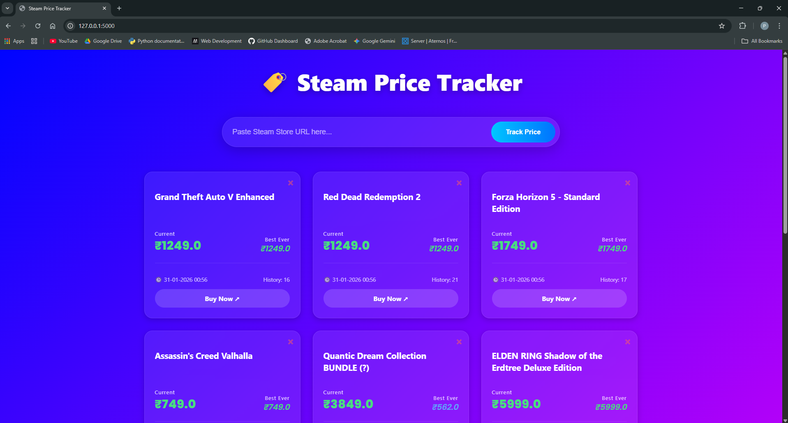

# 🎮 Steam Price Tracker

### A Flask-based web application to track real-time game prices and detect discounts.


## 📖 Overview
**Steam Price Tracker** is a web application designed to help gamers save money by tracking the prices of their favorite games on Steam. Instead of manually checking store pages, users can add games to a dashboard and visualize price trends.

This project demonstrates full-stack capabilities using **Python (Flask)** for the backend, **SQLite** for data persistence, and **HTML/CSS** for the frontend interface.

---

## 📸 Dashboard Preview


---

## ✨ Key Features
* **Real-Time Scraping:** Fetches live price data directly from Steam store pages.
* **Game Management:** Users can add, track, and remove games from their personal watchlist.
* **Price History:** Stores historical price data in a local SQLite database for trend analysis.
* **Responsive UI:** Clean, modern interface built with HTML5 and CSS3.

---

## 🛠️ Tech Stack
* **Backend:** Python, Flask (Microframework)
* **Frontend:** HTML, CSS Templates
* **Database:** SQLite 
* **Scraping:** Requests / BeautifulSoup (BS4)

---

## 🚀 How to Run Locally

### Prerequisites
* Python 3.x installed
* Git installed

### Installation Steps
1.  **Clone the repository**
    ```bash
    git clone [https://github.com/Pranav-Kukreja10/Steam-Price-tracker.git](https://github.com/Pranav-Kukreja10/Steam-Price-tracker.git)
    cd Steam-Price-tracker
    ```

2.  **Create a Virtual Environment (Recommended)**
    ```bash
    python -m venv venv
    # Windows
    venv\Scripts\activate
    # Mac/Linux
    source venv/bin/activate
    ```

3.  **Install Dependencies**
    ```bash
    pip install -r requirements.txt
    ```

4.  **Run the Application**
    ```bash
    python app.py
    ```

5.  **Open in Browser**
    Visit `http://127.0.0.1:5000/` to start tracking!

---

## 🔮 Future Improvements
* [ ] Email notifications for price drops.
* [ ] Price history charts using Chart.js.
* [ ] User authentication system.
* [ ] Deployment to Render or Vercel.
* [ ] More Currency and Time Zones support 

---

## 👨‍💻 Author
**Pranav Kukreja**
* [GitHub Profile](https://github.com/Pranav-Kukreja10)
* [LinkedIn](https://www.linkedin.com/in/pranav-kukreja-540221377)

---
*If you find this useful, leave a ⭐ star on the repo!*
